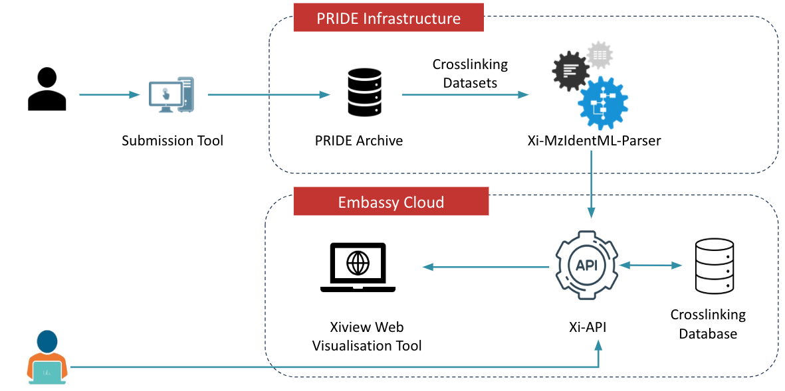
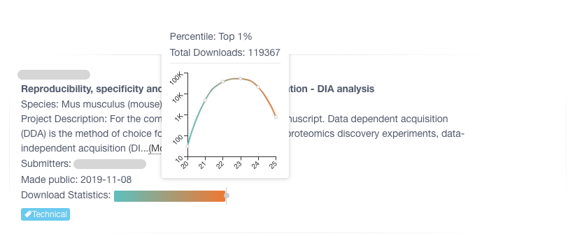
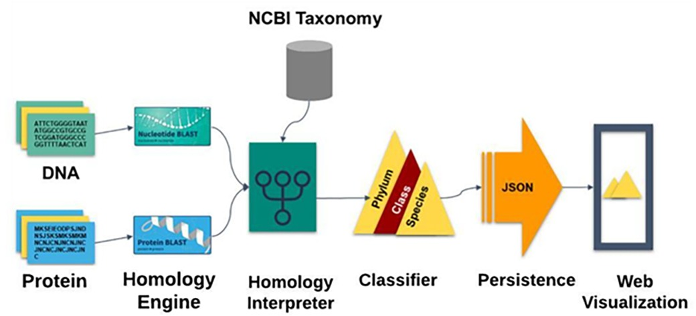
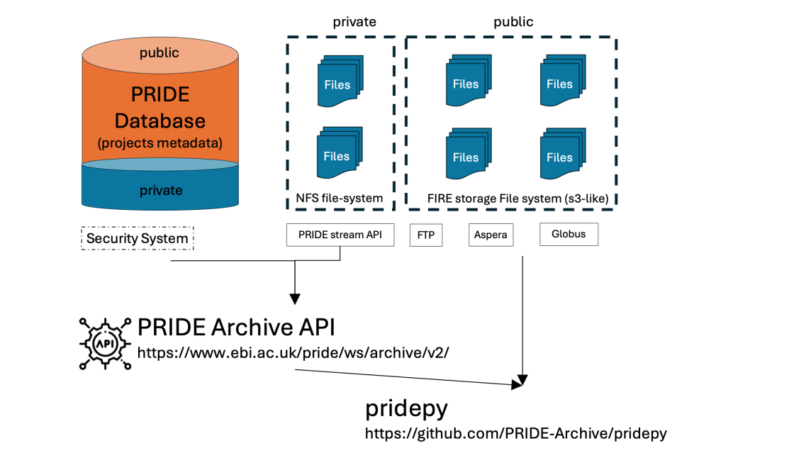
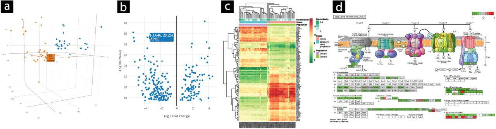
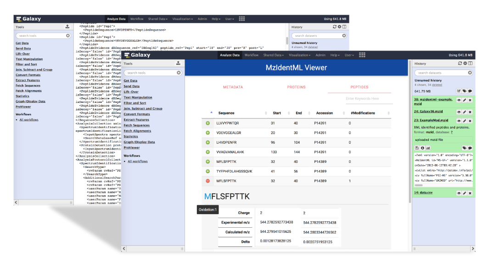
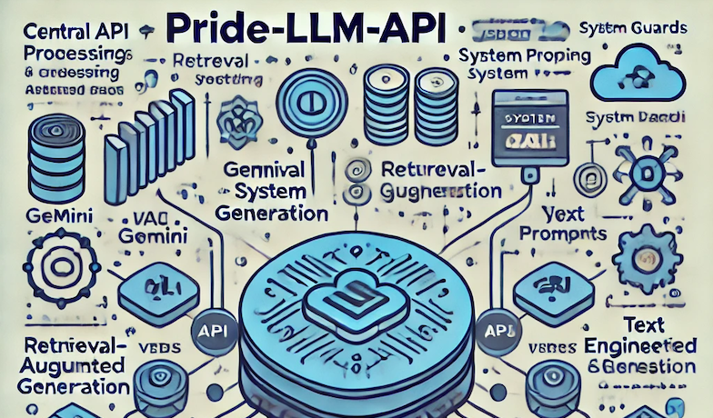

    <!-- Banner Image -->
    

    <!-- Profile Image - Positioned Overlapping the Banner -->
    

  

<h1>Let's explore Behind the CODE</h1>

This site features a collection of projects I've contributed to, including open-source contributions, APIs, large-scale data analysis, and scalable systems.

    

        
        <h3>Crosslinking</h3>
        
Advanced protein crosslinking analysis tool.

        

            Python
            Gitlab CI/CD
            Kubernates
            OpenStack
        

        <a href="projects/crosslinking">Read more</a>
    

    

        
        <h3>Nextflow File Download Statistics Pipeline</h3>
        
Pipeline to analyze file download statistics.

        

            Nextflow
            Slurm
            Dask
            Parallel Computing
        

        <a href="projects/file_download_stats">Read more</a>
    

    

        
        <h3>Orfan-genes</h3>
        
Many sequenced genomes reveal that a significant percentage of genes in a given organism's taxon lack orthologous sequences in other taxa. These are called "orphans" or "ORFans" if present in one species or "taxonomically restricted genes" (TRGs) at higher levels. Research on these genes is key to understanding their origins, but current software for identifying them is limited, complex, and has restricted database access. ORFanID is a user-friendly web-based tool that efficiently identifies orphan genes and TRGs across taxonomic levels, using sequences from large bioinformatics repositories like NCBI. It allows users to control search parameters and presents results in sortable, filterable tables with graphical displays of taxonomic trees.

        

            JAVAFX
            Software Architect
            Google Cloud
            AWS
        

        <a href="projects/orfangenes">Read more</a>
    

    

        
        <h3>pridepy</h3>
        
The Proteomics Identification Database (PRIDE) is the world’s largest repository for proteomics data and a founding member of ProteomeXchange. Here, we introduce pridepy, a Python client designed to access PRIDE Archive data, including project metadata and file downloads. pridepy offers a flexible programmatic interface for searching, retrieving, and downloading data via the PRIDE REST API. This tool simplifies the integration of PRIDE datasets into bioinformatics pipelines, making it easier for researchers to handle large datasets programmatically.

        

            Python
            FTP
            Globus
            HPC Cluster
        

        <a href="projects/pridepy">Read more</a>
    

    

        
        <h3>GeoDiver</h3>
        
GeoDiver is an online web application for performing Differential Gene Expression Analysis (DGEA) and Generally Applicable Gene-set Enrichment Analysis (GAGE) on gene expression datasets from the publicly available Gene Expression Omnibus (GEO). The output produced includes numerous high quality interactive graphics, allowing users to easily explore and examine complex datasets instantly. Furthermore, the results produced can be reviewed at a later date and shared with collaborators.

        

            R language
            Ruby
            Sinatra
            MaterialisedCSS
        

        <a href="projects/geodiver">Read more</a>
    

    

        
        <h3>Galaxy Plugin</h3>
        
This project developed ProExtractor, a Java library that extracts proteomics data from mzIdentML files and converts it into a lightweight JSON format. The ProViewer plugin, built with web technologies, visualizes this data interactively in Galaxy. ProExtractor is 83% faster than MzidToHTML, and ProViewer reduces visualization delays by 98% through caching. ProViewer is integrated into Galaxy and available on the public GIO Galaxy server, with an easy installation script for custom servers.

        

            Visualisation
            Multi-threading
            AJAX
            XML parsing
        

        <a href="projects/viz_galaxy_plugin">Read more</a>
    

     

        
        <h3>Automated Bank Cheque Recongition System using OCR</h3>
        
Automated bank cheque details extraction using Optical Charactor Recongition system. It was recongising Bank No, Account No which are printed charactors 99%, handwritten date recognised 80% and handwritten amount in letters and numbers 63%.

        

            Neural Networks
            Mathlab
            OCR
            C#.NET
        

        <a href="projects/ocr_neural_network">Read more</a>
    

    

        
        <h3>PRIDE-AI-CORE</h3>
        
The Pride-LLM-API is a modular, scalable, and secure API designed for integrating LLM-powered functionalities with structured data storage and retrieval. Built in Python, the project follows a clean architecture with well-defined components.This project act as the base API for AI-driven document processing, retrieval-augmented generation (RAG), and secure NLP applications.

        

            LLM
            Gemini
            ChromaDB
            Prompt Engineering
        

        <a href="projects/pride_api_core">Read more</a>
    

  

  

   