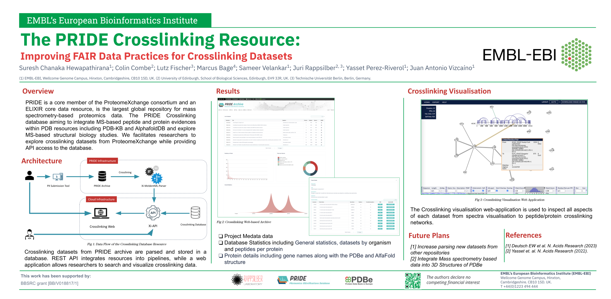
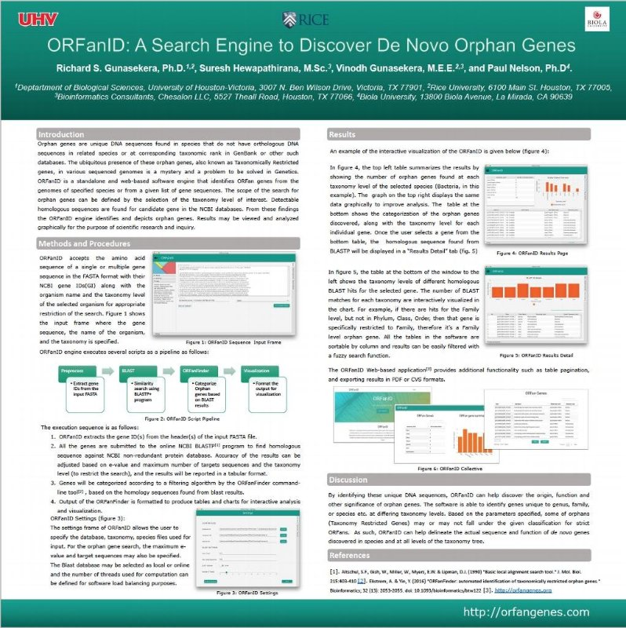
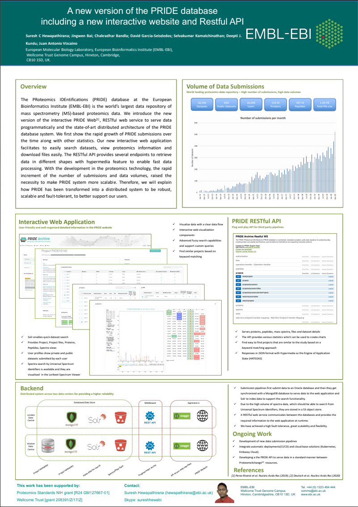

    
    

  

<h1>Let's explore Behind the CODE</h1>

Poster presentations

    

        
        <h3>Crosslinking</h3>
        

            Califonia
            ASMS Conference
            2024
        

    

    

        
        <h3>Orfan-genes</h3>
        

            Texas
        

    

    

        
        <h3>PRIDE Database and APIS</h3>
        

            UK
        

    

    

        
        <h3>PRIDE Submission Tool</h3>
         

            UK
        

    

    

        
        <h3>geodiver</h3>
        

            London
            2016
        

    

  

   